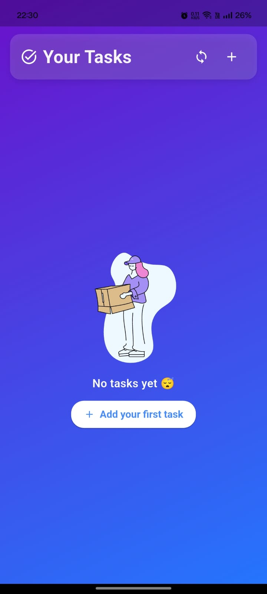
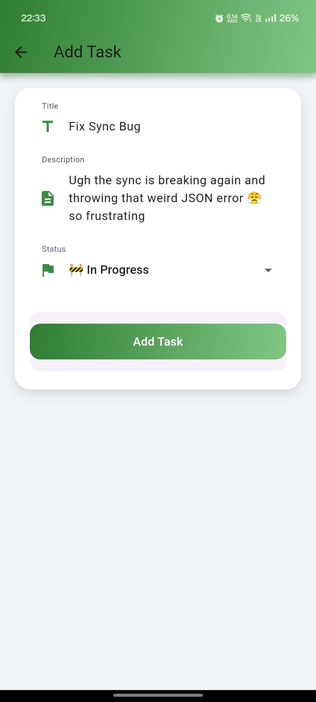
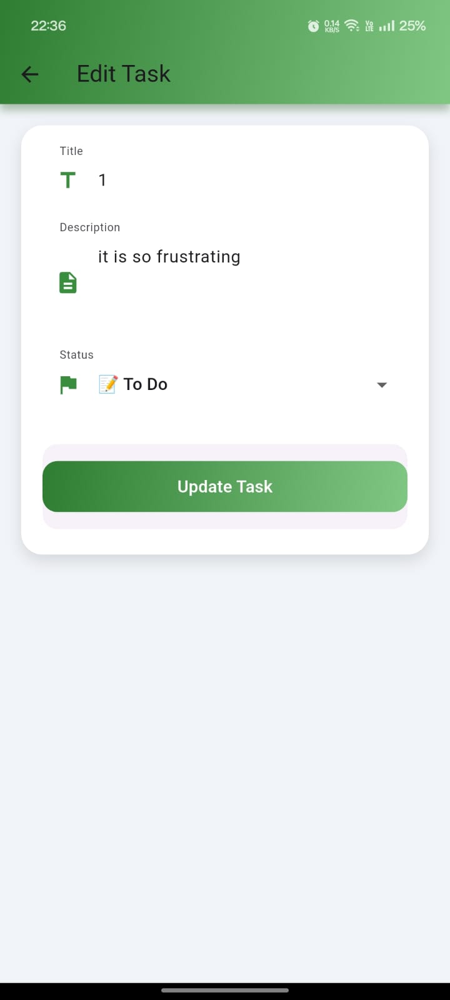
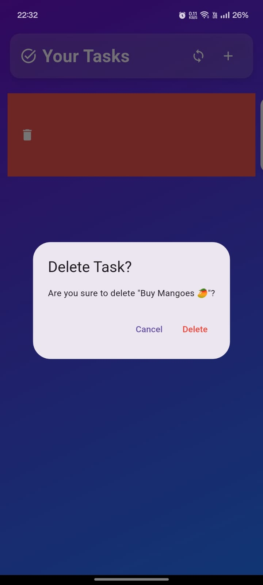
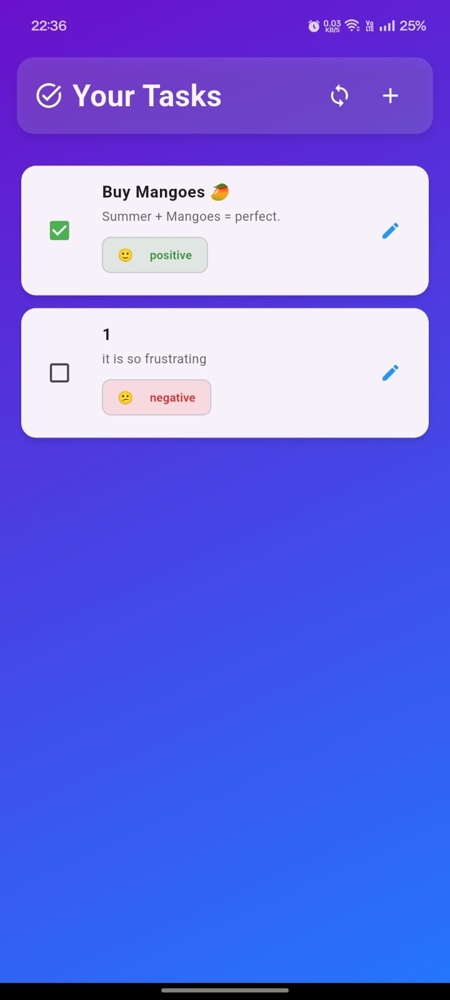

# flutter-task-manager-ai

Flutter Task Manager with AI Sentiment Analysis using TensorFlow Lite (MobileBERT)

---

## 🚀 Project Overview

A sleek Flutter app to manage your daily tasks with offline-first support and AI-powered sentiment analysis. Tasks sync between local storage and a mock remote server, and each task's mood vibes get analyzed using a MobileBERT TFLite model for positive, negative, or neutral sentiment. All wrapped in a smooth, user-friendly UI with animations and swipe gestures.

---

## 🎥 Demo Video

Click the thumbnail below to watch the app demo on YouTube!

[](https://www.youtube.com/shorts/uqJ2315paLc))

---

## 🖼️ Screenshots

Check out some app screenshots showing off key features and UI vibes:

| Home Screen      | Add Task         | Edit Task        |
|------------------|------------------|------------------|
|  |  |  |

| Delete Task       | Check Task        |
|-------------------|-------------------|
|  |  |

---
## 📱 App Structure & Features

### main.dart — App Entry Point

* Initializes Flutter bindings and loads the SentimentService once at startup
* Runs `TaskApp` with a fresh green Material theme
* Starts on `HomeScreen` — the main task list UI

### home\_screen.dart — Main Task List UI & Logic

* Shows tasks from local SQLite DB sorted by last modified date (newest first)
* Add/Edit/Delete tasks with smooth page transitions
* Toggle task completion with checkboxes updating status (todo, in progress, done)
* Swipe-to-delete with confirmation dialog to avoid oopsies
* Manual sync button triggers offline-to-online sync, shows spinner & snackbar feedback
* Uses color codes & emojis to show task status & sentiment vibes:

  * Status colors: green (done), orange (in progress), gray (todo)
  * Sentiment colors: green (positive), gray (neutral), red (negative)
  * Emojis like 🙂, 😐, 😞 to show mood
* Displays a cute Lottie animation with “No tasks yet” when list empty
* Pull-to-refresh to reload tasks manually
* Smooth gradient background & modern card-style list for fresh UI

### add\_edit\_task.dart — Add & Edit Task Screen

* Create new tasks or edit existing ones in a clean, easy form
* Fields:

  * Title (required, validated)
  * Description (optional, multiline)
  * Status dropdown: To Do 📝, In Progress 🚧, Done ✅
* On save:

  * Runs sentiment analysis on combined title + description
  * Saves sentiment label with the task
  * Stores/updates task in SQLite DB
* Styled with rounded input fields & consistent green theme
* Good UX with keyboard-aware scrolling & padding

### sentiment\_service.dart — AI Sentiment Analysis

* Singleton service using MobileBERT TensorFlow Lite model (`mobilebert.tflite`)
* Loads vocab & labels from assets
* Tokenizes & preprocesses input text for model inference
* Runs inference on input tokens & outputs sentiment scores
* Classifies sentiment into: positive, negative, somewhat positive/negative, or error
* Console logs for debugging & monitoring
* Has `init()` to load model and `dispose()` to clean up

### sync\_service.dart — Offline-First Task Sync

* Mock server simulated with an in-memory list of tasks (`_serverTasks`)
* Adds network delay simulation to mimic real latency
* Server operations: fetch, upload/update, delete tasks
* Sync logic:

  * Fetch local & server tasks
  * Initialize server with local data if empty (prevents accidental deletes)
  * Delete tasks removed locally from server
  * Resolve conflicts by newest lastModified timestamp
  * Upload missing local tasks & add missing server tasks locally
  * Remove locally tasks deleted on server
  * Logs sync summary for debugging or UI feedback

---

## ⚙️ Optional Enhancements 🚀

### 1. GitHub Actions Build Script

Automated Flutter APK build on push/PR to main branch using GitHub Actions for CI/CD.

* Checks out repo
* Sets up Flutter (v3.19.6 stable)
* Runs `flutter pub get`
* Builds release APK (`flutter build apk --release`)
* Uploads APK as artifact for easy download

Workflow path: `.github/workflows/build_flutter_apk.yml`

---

### 2. Dockerized Mock Backend Server

A simple Flask mock backend to simulate REST API for task sync.

* Dockerfile based on Python 3.10 with Flask installed
* Runs `mock_server.py` exposing port 5000
* Docker-compose file builds and maps port 5000 for local use

**API Endpoints:**

* `GET /tasks` — fetch all tasks
* `POST /tasks` — add/update a task
* `DELETE /tasks/<task_id>` — delete a task by ID

Run locally with:

```bash
docker-compose up --build
```

---

## 📂 Project Structure Summary

lib/
 ├── main.dart                # App entry
 ├── home_screen.dart         # Task list UI & logic
 ├── add_edit_task.dart       # Add/Edit task form
 ├── sentiment_service.dart   # AI sentiment analysis service
 ├── sync_service.dart        # Offline-first sync logic
 ├── db/
 │    └── task_database.dart  # Local SQLite DB helper
 ├── models/
 │    └── task.dart           # Task data model
 ├── screens/
 │    ├── add_edit_task.dart  # Add/Edit task screen UI
 │    └── home_screen.dart    # Main screen UI
 └── services/
      ├── sentiment_service.dart  # AI sentiment analysis logic
      └── sync_service.dart       # Sync logic between local & server

assets/
 ├── mobilebert.tflite       # TFLite model file
 ├── wordvec.tflite          # Word vector model file
 ├── vocab.txt               # Token vocab for tokenizer
 ├── labels.txt              # Sentiment labels
 ├── empty.json              # Empty JSON for mock server
 ├── sync.json               # Sync data JSON
 ├── testing.md              # Testing notes
 ├── screenshots/
 │    ├── addtask.jpg
 │    ├── checktask.jpg
 │    ├── deletetask.jpg
 │    ├── edittask.jpg
 │    └── homescreen.jpg

.github/
 └── workflows/
      └── build_flutter_apk.yml   # GitHub Actions workflow

docker-compose.yml        # Docker compose file for mock backend
Dockerfile                # Dockerfile for mock backend server
mock_server.py            # Flask mock backend server code

---

## 🛠️ Setup Instructions

Follow the steps below to run the project locally and explore all features:

### 🔧 Prerequisites

Make sure the following are installed:

- [Flutter SDK (v3.19.6 or higher)](https://docs.flutter.dev/get-started/install)
- [Android Studio](https://developer.android.com/studio) or [VS Code](https://code.visualstudio.com/)
- Android Emulator or a physical Android device

### 📦 Clone the Repository

```bash
git clone https://github.com/mayuri996/flutter-task-manager-ai.git
cd flutter-task-manager-ai
```
### 📥 Install Dependencies
flutter pub get
### 📱 Run the App
flutter run
Make sure an emulator is running or a physical device is connected.
---

### ⚙️ Run the Mock Backend (for Sync)

This project includes a **Dockerized Flask mock server**. To run it:

#### 1. Install Docker  
🔗 [Download Docker](https://www.docker.com/products/docker-desktop)

#### 2. Run the backend:

```bash
docker-compose up --build
```
The mock server will start at 👉 http://localhost:5000
---

### 📂 APK File

You can directly install the APK on your Android device without setting up the project manually:

📲 [Download APK via Google Drive](https://drive.google.com/file/d/1XO2cxbes19C41jP9so5csrANEMSa8QiF/view?usp=sharing)

> This is helpful if you want to try the app quickly without setting up Flutter or running the code locally.


